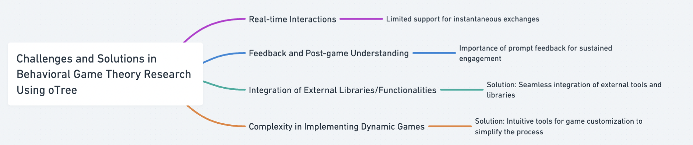
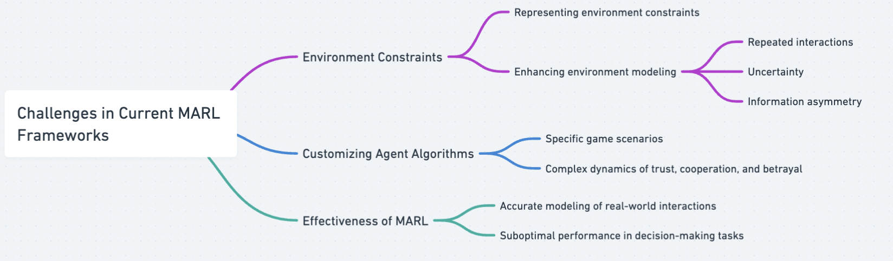
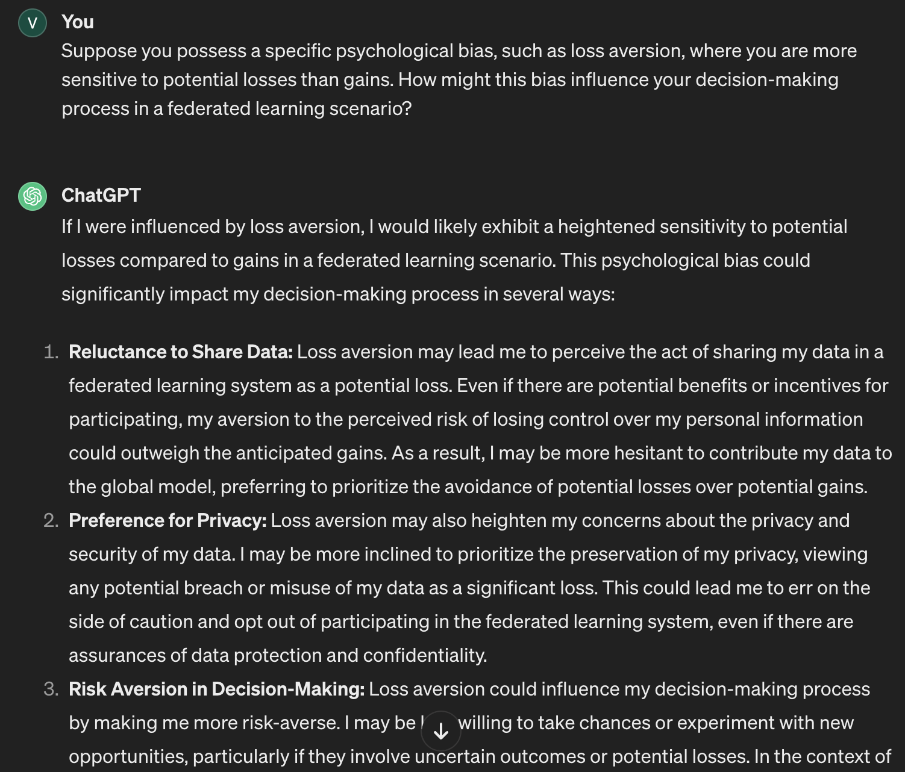
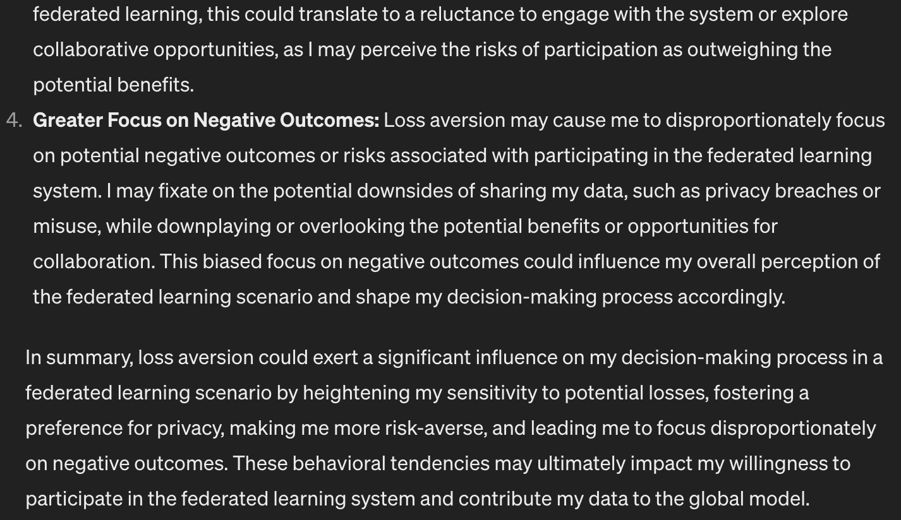
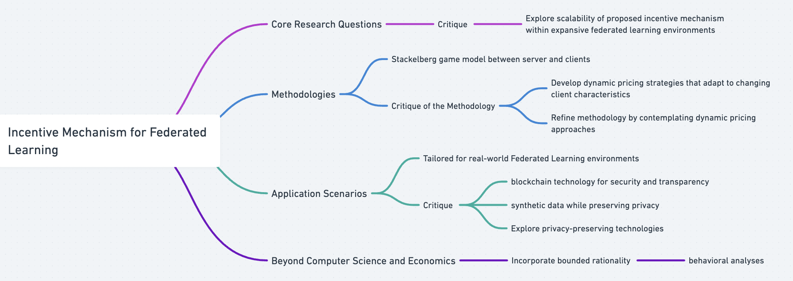
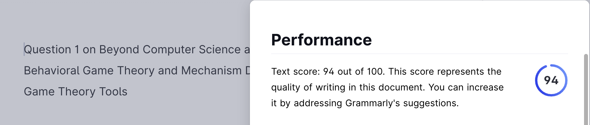

### Question 1: Beyond Computer Science and Economics Methodology 1 Behavioral Game Theory and Mechanism Design: Innovating Behavioral Game Theory Tools

Analyze your experience with oTree, identifying pain points in behavioral game theory research. Review related literature and class discussions to understand experimental economics' goals. Propose a software solution that outperforms oTree in at least three aspects, enhancing strategic interaction studies. Highlight why these advancements are crucial. Submit a concise essay question answer (500 words max) with your analysis and proposals, backed by literature and class insights. Your innovative ideas can significantly contribute to experimental economics, addressing current limitations and paving the way for advanced research methodologies. 

**Figure 1. The Process of the Trust Game via oTree**

**Figure 2. The Result of the Trust Game via oTree**

My experience with oTree for conducting behavioral experiments has been both enlightening and challenging. While it offers flexibility and convenience, several pain points hinder its effectiveness in behavioral game theory research. In deploying the trust game using oTree, I encountered several difficulties reflective of broader challenges in behavioral game theory research. 
One notable issue was the platform’s limited support for real-time interactions, hindering the dynamic nature of strategic interactions. It is found that participants were unable to engage in instantaneous exchanges, affecting the realism and validity of the experiment. This resonates with the findings of Guala and Mittone (2005), who stressed the importance of capturing real-time interactions to ensure the external validity of experimental results. During my experience with the trust game on oTree, I had a significant challenge regarding feedback and post-game understanding. Figure1 shows the process of the trust game via Otree and Figure 2 presents the results. Although I could access the game results after its conclusion as shown in `Figure 2`, I found myself uncertain about how to interpret the outcomes and lacked guidance on potential improvements to my strategies or behaviors within the game. This uncertainty not only diminished my sense of accomplishment and satisfaction from participating but also hindered my ability to learn from the experience and apply insights to future gameplay sessions. Without clear feedback and guidance on the implications of my actions, I felt disconnected from the game’s dynamics and struggled to really engage with the decision-making process of the trust game.
Hence, providing prompt feedback on users' responses is crucial to sustaining their engagement with the game. When players lack clarity about the implications of their choices during gameplay, it can detract from their sense of involvement to a certain degree. Implementing real-time feedback mechanisms, grounded in statistical analysis, can foster deeper cognitive engagement and enhance the overall enjoyment of the gaming experience. This ensures that players receive timely insights into the consequences of their actions, promoting more informed decision-making and a heightened sense of immersion in the gameplay. 
Another issue arises from the cumbersome integration of external libraries or advanced functionalities into oTree experiments, limiting researchers from incorporating sophisticated game theoretic concepts or experimental designs (Cugnasco et al. 2019). The proposed solution tackles this by enabling seamless integration of external tools and libraries, empowering researchers to leverage advanced game theoretic concepts and analytical techniques within a unified framework. By bridging the gap between experimental platforms and external resources, this solution enhances the sophistication and depth of studies, facilitating comprehensive data analysis and interpretation.
Lastly, oTree's complexity in implementing dynamic games poses significant hurdles for researchers, particularly those lacking advanced programming skills (Chen, Schonger, and Wickens 2016). To address this, a proposed solution focuses on offering intuitive tools for game customization, simplifying the process of adjusting payoffs, strategies, and game mechanics. By streamlining these aspects, researchers can devote more attention to experimental design and hypothesis testing, thereby enhancing accessibility and efficiency in experimental setup.

**Figure 3. Mindmap of Question1**

### Question 2: Beyond Computer Science and Economics Methodology 2 Multi-agent Reinforcement Learning: Advancing Multi-Agent Reinforcement Learning

Delve into the limitations of current multi-agent reinforcement learning (MARL) frameworks, focusing on environment constraints and agent algorithm customizations. Choose a classic game (e.g., Prisoner's Dilemma, Battle of the Sexes, or the Trust Game) to illustrate these limitations. Describe the development process of a MARL agent for your selected game, detailing the definition of states, actions, and rewards grounded in fundamental behavioral assumptions. Your analysis should provide insights into overcoming MARL's current limitations, fostering advancements in the field. Submit a comprehensive report (500 words max) with your findings and proposals.

Current MARL frameworks encounter challenges in adequately representing environment constraints and customizing agent algorithms to suit specific game scenarios. These limitations can hinder the effectiveness of MARL in accurately modeling real-world interactions and may lead to suboptimal performance in decision-making tasks. For example, in the context of the Prisoner's Dilemma, existing MARL frameworks may struggle to capture the complex dynamics of trust, cooperation, and betrayal due to oversimplified state representations and reward structures.
In deploying a MARL agent for the Prisoner's Dilemma, the following components are defined, which can also be represented in the code. States in the Prisoner’s Dilemma environment encompass information about the actions and strategies of both players, as well as any contextual variables influencing decision-making. For instance, states may include the history of previous interactions, the current round of the game, and the observed behaviors of the opponent. Additionally, the action space in this case consists of two possible actions for each player, cooperating or defecting, which represent the strategic choices available to players in each round of the game and form the basis for decision-making in the MARL framework. In this context, rewards are typically structured to incentivize cooperation and punish defection. For example, players receive higher rewards for mutual cooperation, lower rewards for mutual defection, and negative rewards for being exploited by the opponent.
Based on my personal experience, deploying the Prisoner's Dilemma game using existing MARL frameworks highlighted the challenges of effectively representing the complexities of human decision-making and strategic interactions. The oversimplified state representations and reward structures often led to suboptimal performance and limited the realism of simulated interactions. Therefore, it underscored the importance of addressing the current limitations of MARL frameworks to enhance their applicability and effectiveness in modeling real-world scenarios. To address the limitation, a possible solution is to enhance the environment modeling. By considering factors such as repeated interactions, uncertainty, and information asymmetry, it is likely to develop MARL frameworks capable of representing the intricate dynamics of the Prisoner’s Dilemma more accurately. This involves incorporating more sophisticated state representations and reward structures to capture the complexities of real-world interactions. 

**Figure 4. Mindmap of Question2**

### Question 3: Brainstorm your research idea by criticizing existing research: Critiquing and Expanding upon Existing Research

Objective: The goal of this assignment is to engage critically with existing research in the field of federated learning, using the specific paper presented by the guest speaker as a primary example. Students will assess the paper's research questions, methodologies, and application scenarios and propose new research ideas addressing the identified limitations or gaps.

Instructions:
1. Summary of the Paper
Core Research Questions: Briefly summarize the paper's primary research questions. What is the main problem or challenge the paper seeks to solve or understand?

Methodologies: Describe the methods employed in the paper to address the research questions. Consider the approaches, models, or experimental designs used.

Application Scenarios: Outline the application scenarios discussed in the paper. How does the paper propose to apply its findings or solutions in real-world contexts?

2. Critique of the Research Question
Reflect on the research questions posed in the paper. Are there other more significant objectives or questions that could be more relevant or impactful in this context? Explain why these alternative questions or objectives might offer more value or insight.

3. Critique of the Methodology
Analyze the assumptions made in the paper regarding the strategic environment and behavioral foundations. Discuss whether these assumptions are justified or if they require more reasonable treatment. Suggest how the methodology could be improved or altered to address these concerns.

4. Critique of the Application Scenario
Evaluate the relevance and currency of the federated learning scenarios presented in the paper. With the rapid advancement in technology, consider whether there are more modern or advanced application scenarios that could be more effective in solving similar issues, such as blockchain, generative AI, other privacy-preserving technologies, or quantum computing.

5. Beyond Computer Science and Economics
Consider the role of bounded rationality in both human and AI agents within the context of the paper's findings. Propose how the results might change if the study incorporated participants with specific psychological heuristics or different versions of AI, such as ChatGPT.

#### Part 1: Summary of the Paper
**Core Research Questions:** This paper addresses the primary research challenge, which is to mitigate bias in the global model obtained through Federated Learning by designing an incentive mechanism that involves random participation of clients, ensuring unbiased client participation.
**Methodologies:** This paper employs a Stackelberg game model between the server and clients to simulate strategic interactions and decision-making processes. The model incorporates decision-making problems related to participation levels, partial costs, and intrinsic values into the global model to maximize the utility function of each client. Additionally, it conducts convergence component analysis of randomly participating clients' participation levels to establish error convergence boundaries and key assumptions for the optimization process.
**Application Scenarios:** The proposed incentive mechanism is tailored for implementation in real-world Federated Learning environments, encouraging diverse client participation and intrinsic motivation to contribute to the global model. The paper introduces an interactive payment scheme that considers client preferences and costs, aiming to attract client participation and suggests practical methods to enhance the overall performance of the Federated Learning system.

#### Part 2: Critique of the Research Question
The paper's main inquiry revolves around crafting an incentive mechanism for federated learning where client participation is randomized to ensure fairness in the resulting global model, irrespective of full client involvement. While pivotal in federated learning setups, an additional significant goal could be to explore the scalability of the proposed incentive mechanism within expansive federated learning environments. Examining how the mechanism operates and adjusts with an escalating number of clients and data volume could yield crucial insights into its practicality and effectiveness in real-world contexts. This scalability could provide extra value by tackling the challenges associated with federated learning on a larger scale and augmenting the applicability of the proposed solution.

#### Part 3: Critique of the Methodology
The methodology relies on several fundamental assumptions, such as assuming that each client's local function possesses the unbiasedness of stochastic gradients from each client, and the boundedness of expected squared norms of stochastic gradients for each client. While these assumptions are standard in convex federated learning problems, the potential variability in data distribution among clients, which may affect the accuracy of pricing design. To address these concerns and refine the methodology, the paper could contemplate developing dynamic pricing strategies that adapt to changing client characteristics and environmental conditions. Instead of relying on fixed pricing schemes, dynamic pricing approaches can adjust incentives based on real-time data updates, client feedback, and performance metrics. This flexibility allows the pricing mechanism to respond effectively to shifts in data distribution, client preferences, and market dynamics, ensuring optimal client participation and model convergence in federated learning settings.

#### Part 4: Critique of the Application Scenario
The federated learning scenarios discussed in the paper remain pertinent and timely in tackling the complexities of designing incentive mechanisms for federated learning systems involving partial client participation. However, given the rapid evolution of technology, there exist more contemporary and advanced application scenarios that may offer heightened efficacy in addressing similar challenges. For instance, the integration of blockchain technology has the potential to promote the security and transparency of federated learning systems. Furthermore, the utilization of Generative AI can facilitate the generation of synthetic data for model training in a manner that preserves privacy. Similarly, the exploration of other privacy-preserving technologies like differential privacy could offer additional layers of protection for sensitive data throughout the federated learning process. Additionally, the burgeoning field of quantum computing holds promise for expediting computations in federated learning while also enhancing data privacy and security. By incorporating these modern technologies into federated learning frameworks, it becomes feasible to tackle existing challenges more adeptly and propel the capabilities of collaborative machine learning systems forward.

#### Part 5: Beyond Computer Science and Economics
Incorporating the concept of bounded rationality in both human participants and AI agents within the context of the paper's findings could yield significant implications on the outcomes. As shown in `Figure 5` and `Figure 6`,ChatGPT's responses demonstrate that AI agents' decisions to participate can be influenced by rational considerations similar to human participants. If human participants and AI agents exhibit biases like loss aversion, their reluctance to participate may significantly impact the effectiveness of incentive mechanisms and the overall performance of federated learning systems. The mini-experiment highlights the necessity of conducting behavioral analyses to understand the decision-making processes of both human participants and AI agents in federated learning environments. Integrating insights from AI agents' decision-making into the paper's analysis could provide a more comprehensive understanding of the dynamics and challenges inherent in incentivizing participation in federated learning systems.

**Figure 5. Screenshot of ChatGPT's response 1**

**Figure 6. Screenshot of ChatGPT's response 2**

**Figure 7. Mindmap of Question3**

### Bibliographies

Chen, Daniel L., Martin Schonger, and Chris Wickens. 2016. “OTree—an Open-Source Platform for Laboratory, Online, and Field Experiments.” Journal of Behavioral and Experimental Finance 9 (March): 88–97. https://doi.org/10.1016/j.jbef.2015.12.001.

Cugnasco, Cesare, Hadrien Calmet, Pol Santamaria, Raül Sirvent, Ane Beatriz Eguzkitza, Guillaume Houzeaux, Yolanda Becerra, Jordi Torres, and Jesus Labarta. 2019. “The OTree: Multidimensional Indexing with Efficient Data Sampling for HPC.” IEEE Xplore. December 1, 2019. https://doi.org/10.1109/BigData47090.2019.9006121.

Guala, Francesco, and Luigi Mittone. 2005. “Experiments in Economics: External Validity and the Robustness of Phenomena.” Journal of Economic Methodology 12 (4): 495–515. https://doi.org/10.1080/13501780500342906.

Luo, Bing, Yutong Feng, Shiqiang Wang, Jianwei Huang, and Leandros Tassiulas. 2023. “Incentive Mechanism Design for Unbiased Federated Learning with Randomized Client Participation.” ArXiv (Cornell University), April. https://doi.org/10.48550/arxiv.2304.07981.

