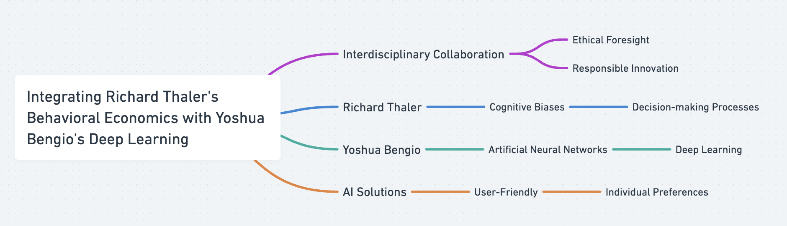
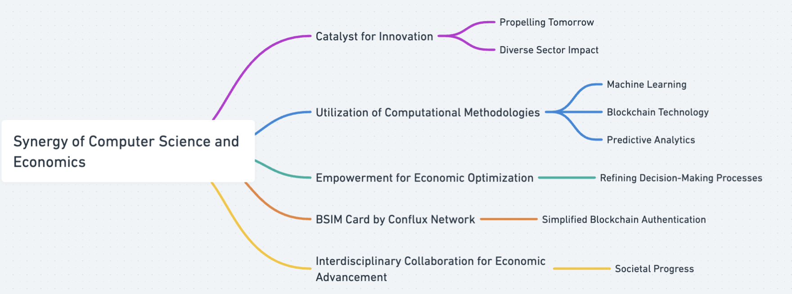
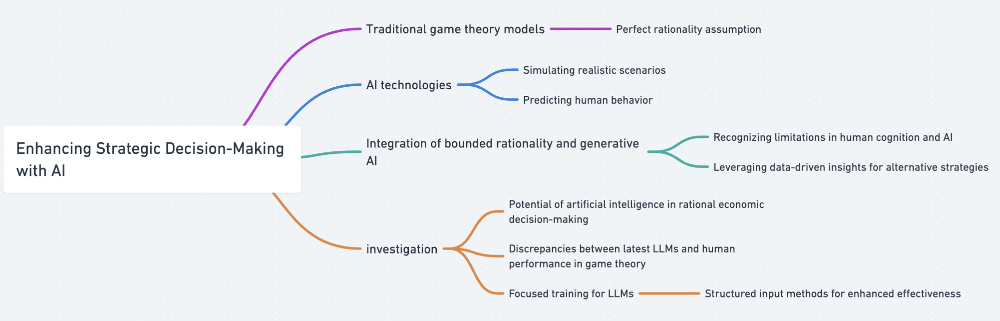
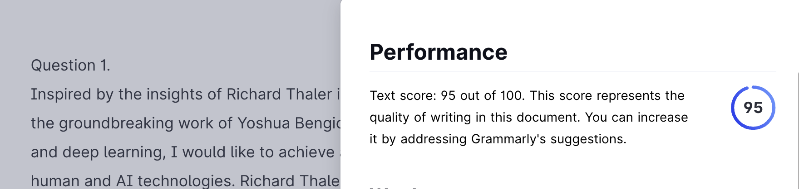

### Question 1: When computer science meets economics: Who do you truly want to become? Pick one of your favorite Nobel Prize winners (https://www.nobelprize.org/) and Turing Award winners (https://amturing.acm.org/). How do you want to contribute to the intersection of the two north stars to advance human civilizations? 

Inspired by the insights of Richard Thaler in behavioral economics with the groundbreaking work of Yoshua Bengio in artificial neural networks and deep learning, I would like to achieve a better interaction between human and AI technologies. Richard Thaler is one of my favorite Nobel laureates whose pioneering work in behavioral economics has shed light on the cognitive biases and irrational decision-making processes that underpin economic behavior ([Thaler 2017](https://www.nobelprize.org/prizes/economic-sciences/2017/thaler/facts)). By integrating his insights into AI systems, it is possible to create algorithms that not only process data efficiently but also understand and adapt to human behaviors, preferences, and biases. In addition, Turing Award recipient Yoshua Bengio’s contributions to deep learning have revolutionized the field of AI by enabling machines to learn complex patterns from data ([Haigh 2018](https://amturing.acm.org/award_winners/bengio_3406375.cfm)). By combining Thaler’s understanding of human behavior with Bengio's advancements in deep learning and neural networks, I obtained the inspiration to develop AI solutions that are not only technically sophisticated but also genuinely useful and user-friendly. This could involve creating intelligent systems that adapt to individual preferences and provide personalized recommendations or assistance in various domains. It is worth noting that this vision will require interdisciplinary collaboration, ethical foresight, and a commitment to responsible innovation.

Figure 1. Mindmap of Question1

### Question 2: CS&Econ for a Better Future: How do you perceive the synergy between computer science and economics as a catalyst for steering innovation toward a brighter future? Please present a foundational assertion, followed by multiple specific instances that support your claim, including a reference to a topic discussed at the colloquium on Friday, March 22.

Positioned as a catalyst for propelling innovation towards a more promising tomorrow, the synergy of computer science and economics serves as a driving force across diverse sectors, notably within financial markets and decentralized finance. Through the utilization of computational methodologies such as machine learning, blockchain technology, and predictive analytics, individuals are empowered to unlock novel avenues for optimizing economic frameworks, refining decision-making processes, and ultimately shaping a brighter societal future. The BSIM card, introduced by Conflux Network, stands as a poignant testament to the amalgamation of computational techniques within blockchain technology, symbolizing the transformative capacity of interdisciplinary collaboration in fostering economic advancement and societal progress. As articulated by Ming Wu, the Chief Technology Officer of Conflux Network, the development of the BSIM card addresses the complexity associated with traditional blockchain authentication methods, offering users a simplified solution through the integration of phone numbers and authentication codes. This innovation enables users to seamlessly access a multitude of blockchain-based functionalities, heralding a more accessible and user-friendly approach to blockchain technology adoption. In essence, the synergy of computer science and economics promotes promising innovation for our society.

Figure 2. Mindmap of Question2

### Question 3: Beyond CS & Econ: How are aspects of human nature, like bounded rationality, and pioneering technologies, such as generative AI, reshaping the dynamics between humans and AI agents in strategic contexts? Additionally, how might this interplay be perceived and conceptualized distinctively from current models? Address this inquiry by drawing upon the literature covered in our lectures and supplementary scholarly works, ensuring to include in-text citations and a comprehensive bibliography.

Traditional game theory models often assume perfect rationality, a simplistic premise that fails to capture the intricacies of human decision-making. In contrast, AI technologies offer the ability to simulate realistic scenarios and predict human behavior in strategic contexts. These AI agents possess adaptive capabilities, learning from interactions with humans and their environments. Consequently, they can significantly enhance strategic decision-making by providing insights into opponent strategies and optimizing outcomes. The integration of bounded rationality and generative AI transforms the dynamics between humans and AI agents in strategic settings. Rather than treating AI as perfectly rational actors, this perspective recognizes the limitations inherent in both human cognition and artificial intelligence. Human decision-makers may leverage AI to compensate for cognitive biases, utilizing data-driven insights to devise alternative strategies. Conversely, AI agents learn from human behavior, adjusting their strategies dynamically to foster adaptive interactions.

Chen et al.'s ([2023](https://doi.org/10.1073/pnas.2316205120)) investigation underscores the potential of artificial intelligence to excel in rational economic decision-making, surpassing human capabilities across various domains. However, they acknowledge that current large language models (LLMs) exhibit sensitivity to contextual nuances, indicating room for improvement in practical applications. Additionally, Fan et al.'s ([2023](https://doi.org/10.48550/arXiv.2312.05488)) research highlights discrepancies between the latest LLMs, such as GPT-4, and human performance in game theory, suggesting ongoing refinement is necessary for practical viability.

In contrast, Zhou et al. ([2024](https://doi.org/10.48550/arXiv.2402.12713)) propose focused training and structured input methods as means to enhance LLM effectiveness. Despite the need for cautious consideration, the potential to leverage AI capabilities for more efficient strategic adaptation and decision-making processes remains promising. Future advancements in AI hold the promise of unlocking greater potential in strategic contexts, provided careful attention is given to refining and optimizing AI models.

Figure 3. Mindmap of Question3

### Bibliographies

- Chen, Yiting, Tracy Xiao Liu, You Shan, and Songfa Zhong. 2023. “The Emergence of Economic Rationality of GPT.” Proceedings of the National Academy of Sciences of the United States of America 120 (51). [DOI: 10.1073/pnas.2316205120](https://doi.org/10.1073/pnas.2316205120).
- Fan, Caoyun, Jindou Chen, Yaohui Jin, and Hao He. 2023. “Can Large Language Models Serve as Rational Players in Game Theory? A Systematic Analysis.” ArXiv.org. December 12, 2023. [DOI: 10.48550/arXiv.2312.05488](https://doi.org/10.48550/arXiv.2312.05488).
- Haigh, Thomas . 2018. “Yoshua Bengio - A.M. Turing Award Laureate.” Amturing.acm.org. 2018. [Link](https://amturing.acm.org/award_winners/bengio_3406375.cfm).
- Thaler, Richard. 2017. “The Sveriges Riksbank Prize in Economic Sciences in Memory of Alfred Nobel 2017.” NobelPrize.org. 2017. [Link](https://www.nobelprize.org/prizes/economic-sciences/2017/thaler/facts/).
- Zhou, Yuhang, Yuchen Ni, Xiang Liu, Jian Zhang, Sen Liu, Guangnan Ye, and Hongfeng Chai. 2024. “Are Large Language Models Rational Investors?” ArXiv.org. February 19, 2024. [DOI: 10.48550/arXiv.2402.12713](https://doi.org/10.48550/arXiv.2402.12713).

