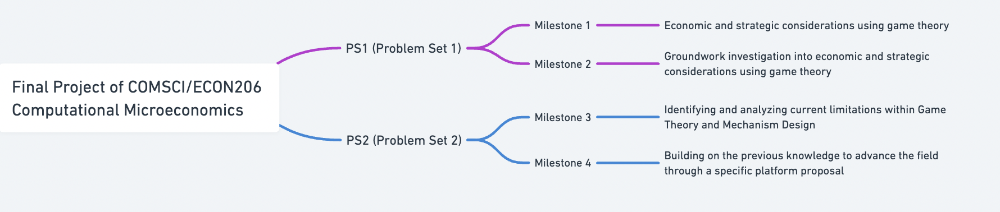

# CSECON206_Spring2024

## Investigating the role of social networks in mitigating information asymmetry in economic transactions

## Project Information
- **Author**: Hantian Zhang, Majoring in Applied Mathematics and Computational Sciences, Class of 2025, Duke Kunshan University
- **Instructor**: Professor Luyao Zhang, Duke Kunshan University
- **Disclaimer**: This is a submission for the Final Project in [COMSCI/ECON 206 Computational Microeconomics](https://ms.pubpub.org/), Spring 2024 Term (Seven Week - Fourth), taught by Professor Luyao Zhang at Duke Kunshan University.
- **Acknowledgements**: I would like to express my sincere gratitude to my instructor Luyao Zhang for her invaluable guidance and unwavering support throughout the course of this research endeavor. Her expertise, mentorship, and constructive feedback have been instrumental in shaping the direction and depth of this study. Furthermore, I extend my appreciation to my classmates for their engaging discussions and insightful input, which have contributed significantly to the development of this research. Finally, I would like to offer a heartfelt thank you to my friends and family for their unconditional encouragement and understanding during this academic journey. Their unwavering support and belief in my abilities have been a constant source of motivation and inspiration. This research would not have been possible without the collective encouragement and assistance of these individuals, and for that, I am profoundly grateful.

Please provide an introduction to the content of this GitHub repository, bearing in mind that external viewers may not be familiar with the terms PS1, PS2, and the Final Project as used in our class. It is essential to include enough background information to bring outsiders up to speed. Additionally, include a flowchart that clearly outlines the logical progression and the interconnections between these assignments for a clearer understanding of the course structure.

## Introduction of Computational Microeconomics Final Project

Welcome to the GitHub repository for Final project of COMSCI/ECON206 Computational Microeconomics, instructed by Prof. Luyao Zhang at DKU. This course introduces students to the fundamentals of game theory and equips them with the computational tools necessary to analyze and model complex economic systems. In this repository, you will find explanations for the questions regarding game theory assigned in the milestones. By exploring the intersection of computer science and economics, you are expected to develop a deeper understanding of how computational techniques can be applied to address real-world economic challenges. The final project proposes a novel solution or improvement to the identified problem, potentially integrating interdisciplinary insights or emerging technologies, which consists of PS1 and PS2.

- **PS1 (Problem Set 1)**: This initial assignment comprises two milestones, serving as a groundwork investigation into economic and strategic considerations using game theory.

- **PS2 (Problem Set 2)**: Building on the knowledge from PS1, PS2 includes two additional milestones that helps identify and analyze current limitations within Game Theory and Mechanism Design. 

Here is the flowchart providing a visual guide to how this project highlights the progression from a general understanding of Game Theory to the creation of a specific research proposal aimed at advancing the field. 

## Table of Contents

In this repository, you will find the following:

- [README.md](README.md): introduction of the GitHub Repository as the Answers to Final Project
- [CSEcon](CSEcon/README.md): A polished version of the Problem Set 1
- [Advance_CSEcon](Advance_CSEcon/README.md): A polished version of the Problem Set 2

## More About the Author

- **Self-Introduction**: I am Hantian Zhang from Jiangsu Province, China. Now I’m a junior student majoring in Math with CS track. I am deeply interested in economics, and I enjoy learning relative knowledge. I am dedicated to continuous learning and staying updated with the latest advancements in game theory. 

- **Final Reflections**: 
  - **Intellectual Growth**: Insights and knowledge acquired.
  - **Professional Growth**: Skills developed and career aspirations.
  - **Living a Purposeful Life**: Personal achievements and future goals.
